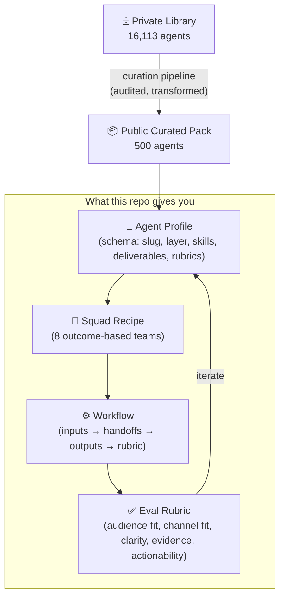

# Open Agent Marketplace

[](LICENSE) [](#) [](agents/public-curated-500) [](#) [](#) [](https://github.com/contentincubator2-ops/open-agent-marketplace/releases) [](CONTRIBUTING.md)

**Build your own AI marketing team marketplace — with reusable agent profiles, squad recipes, workflow templates, sample cases, and evaluation rubrics.**

Open Agent Marketplace is an open-source starter kit for builders, agencies, founders, and marketing teams who want to compose AI agents into working marketing squads. Instead of shipping a raw agent list, the repo gives you public-safe schemas, fictional sample agents, outcome-based squad recipes, workflow handoffs, and a lightweight browser demo.

```txt
> Open Agent Marketplace
> Marketing Agent OS for reusable AI teams

const agents = 528;           // 28 starter + 500 public-safe curated profiles
const squads = 8;
const privateLibrarySize = 16113;  // source library audited for public release
// Discover, compose, run, and evaluate AI marketing teams
```

## Architecture



## Why this exists

Most AI-agent repos stop at one of three layers: a list of tools, a single automation demo, or a generic agent marketplace shell.

This repo focuses on the **missing operating layer** for marketing work: which marketing agents should exist, how they should be grouped into teams, what inputs and outputs each workflow requires, and how agent work should be evaluated before it reaches a customer.

## How it compares

| | Open Agent Marketplace | CrewAI | LangGraph | AutoGPT |
|---|---|---|---|---|
| **Focus** | Marketing-specific agent OS | General multi-agent framework | Graph-based LLM orchestration | Autonomous general agent |
| **Agent profiles** | ✅ 528 structured profiles with schema | ❌ define your own | ❌ define your own | ❌ generic |
| **Squad recipes** | ✅ 8 outcome-based marketing squads | ⚠️ example-only | ⚠️ example-only | ❌ |
| **Eval rubrics** | ✅ per-agent quality rubrics | ❌ | ❌ | ❌ |
| **Private library signal** | ✅ 16,113-agent source library | ❌ | ❌ | ❌ |
| **No infra required** | ✅ JSON + browser demo | ❌ Python env required | ❌ Python env required | ❌ |
| **Open-source** | ✅ MIT | ✅ MIT | ✅ MIT | ✅ MIT |

> **In short:** CrewAI / LangGraph / AutoGPT give you the orchestration engine. This repo gives you the **agent content layer** — the structured profiles, team compositions, and quality rubrics that make an AI marketing team actually useful.

## What this includes

- **528 agent profiles** — 28 fictional starter agents + 500 public-safe curated profiles derived from a private 16,113-agent library
- Public agent profile schema, squad composition schema, and skill binding schema
- **8 outcome-based marketing squad recipes** — SaaS Launch, Ecommerce Growth, B2B ABM, Local Lead Gen, Creator Growth, Content Engine, B2B Sales, Marketplace Growth
- **6 workflow templates** — positioning-to-campaign, content-engine, paid-ads, SEO, email-lifecycle, social-listening
- **5 fictional marketing case packs** — B2B SaaS launch, DTC skincare, local dental lead gen, online course funnel, ecommerce marketplace listing
- Agent quality rubric and sample eval cases
- Lightweight browser demo UI
- Validation scripts and sensitivity sweep for public-release safety
- MIT License, CONTRIBUTING guide, SECURITY policy

## Private 16,000+ Agent Library

The 500 curated profiles in `agents/public-curated-500/` are derived from a private library of **16,113 agents**. The curation pipeline audited 1,689 public-safe candidates and selected 500 for this release. Every profile is transformed to exclude internal prompts, customer records, credentials, and operational fields. See [agents/public-curated-500/README.md](agents/public-curated-500/README.md) for the full release policy.

## What this is not

This repository is not a dump of any private database. It intentionally excludes private customer data, internal prompts, credentials, operational URLs, private workspaces, and commercial performance metrics.

## Quick start

```bash
npm install
npm run validate
npm run sweep
npm run demo
```

Then open: `http://localhost:4173/app/web/`

## Directory structure

| Folder | Contents |
|--------|----------|
| `.github/` | Contribution templates and CI |
| `agents/public-curated-500/` | 500 public-safe curated agent profiles from a 16K+ private library |
| `app/web/` | Minimal marketplace UI demo |
| `data/` | Fictional sample data and public curated JSON packs |
| `docs/` | Public design, schema, taxonomy, rubric, and roadmap docs |
| `evals/` | Marketing-agent evaluation cases and sample results |
| `examples/` | Agent, squad, and marketing-case examples |
| `launch/` | Public launch copy and distribution assets |
| `recipes/` | Ready-to-copy marketing squad recipes |
| `schema/` | JSON schemas for agents, squads, and skills |
| `templates/` | Reusable agent, squad, and workflow templates |
| `workflows/` | Marketing workflow templates with inputs, handoffs, and rubrics |
| `scripts/` | Validation and export helper scripts |

## Core concepts

**Agent** — A reusable AI worker profile with a role, skill set, operating style, example tasks, marketing channel expertise, funnel coverage, deliverables, and quality expectations.

**Squad** — A prebuilt team of agents designed around a business outcome such as launching a SaaS product, growing ecommerce revenue, running ABM, building a content engine, or improving local lead generation.

**Workflow** — A reusable operating pattern that defines inputs, agent handoffs, outputs, and review criteria. Workflows make the marketplace operational instead of merely searchable.

**Evaluation rubric** — A public checklist for reviewing agent outputs before they are shipped. Marketing work is evaluated for audience specificity, channel fit, strategic clarity, evidence quality, brand voice, and actionability.

## Example agent

```json
{
  "slug": "positioning-strategist",
  "name": "Nora Ellis",
  "title": "Positioning Strategist",
  "layer": "strategy",
  "category": "Strategy",
  "primarySkill": "positioning",
  "channelExpertise": ["Landing Pages", "Sales Enablement", "Product Marketing"],
  "funnelStage": ["consideration", "conversion"],
  "deliverables": ["positioning brief", "message map", "differentiation matrix"],
  "summary": "Turns market context, customer pain, and product proof into crisp positioning."
}
```

## Example squads

- **saas-launch-squad** — positioning, launch page, content, lifecycle, and measurement
- **ecommerce-growth-squad** — product page, paid ads, UGC, email/SMS, and ROAS review
- **b2b-abm-squad** — ICP, account research, outbound, LinkedIn, and sales collateral
- **local-service-lead-gen-squad** — local SEO, paid search, reviews, landing pages, CRM follow-up
- **creator-growth-squad** — content strategy, shorts, newsletter, community, analytics

See [recipes/marketing-squads/](recipes/marketing-squads/) and [data/squads.sample.json](data/squads.sample.json).

## Public-safe contribution model

Contributions are welcome when they add reusable, fictional or public-safe assets: agent profiles, squad recipes, workflow templates, eval cases, taxonomy improvements, and demo UI improvements.

Before opening a PR, run `npm run validate` and `npm run sweep`.

## Changelog

See [CHANGELOG.md](CHANGELOG.md) for version history.

## License

MIT
